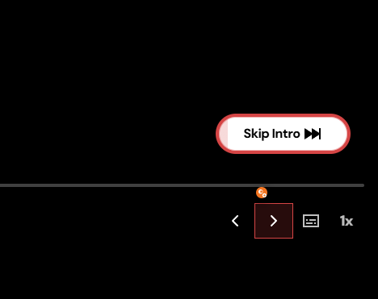

# Crunchy+

Crunchy+ improves Crunchyroll experience.

## Download

- Direct ZIP Download: [https://github.com/yurinb/crunchyplus_extension/archive/refs/heads/main.zip](https://github.com/yurinb/crunchyplus_extension/archive/refs/heads/main.zip)

## What It Does

- Auto-skips Intro, Recap, Preview, and Credits when skip buttons appear.
- Adds Previous and Next episode buttons directly in the player controls.
- Shows visual action feedback and lets you tune behavior from the popup.

## Install

1. Open Chrome and go to `chrome://extensions`.
2. Enable **Developer mode**.
3. Click **Load unpacked**.
4. Select this extension folder.
5. Pin **Crunchy+** from the extensions menu for quick access.

## How To Use

1. Open any video on Crunchyroll.
2. Click the **Crunchy+** icon in the Chrome toolbar.
3. Choose your theme and enable/disable features:
- Auto-Skip
- Episode Navigation
- Advanced behavior options
4. Click **Save Settings**.

Settings apply immediately on the page.

## Quick Tips

- If buttons do not appear, refresh the Crunchyroll tab.
- If you changed options, click **Save Settings** before closing the popup.
- Keep Auto-Skip enabled for the smoothest playback experience.

## Privacy

Crunchy+ runs only on Crunchyroll pages and stores your preferences locally in browser extension storage.
